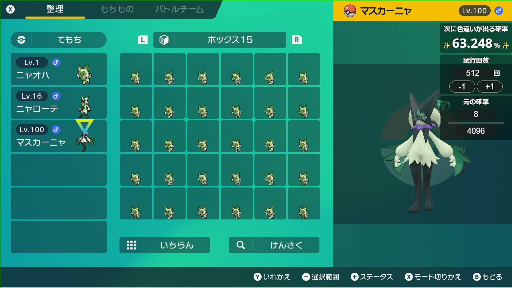

# Shiny Counter Overlay

ポケットモンスターシリーズの色違いのポケモンが出現する確率をOBS等のオーバーレイとして表示するためのリポジトリ。
GitHubPagesを利用して動かします。

## 特徴

- 配信画面に配置できるタイプのカウンター
- cookieによる確率の保存機能
- 背景が半透明なのでゲーム画面またはお使いのオーバーレイに馴染みます

## 進捗

- [x] 1匹のときの計算結果を出力する
- [x] cookieによる保存機能
- [ ] デザインを整える
- [ ] ~~背景をグリーンにするオプション~~

### 検討中

- [ ] ファイルのI/Oによる保存機能
- [ ] 2匹以上の場合の確率計算

## 使用方法

### OBS側

1. ブラウザソースを追加
2. URLに`https://ogurana17.github.io/ShinyCounterOverlay/`を入力
3. 幅`180`高さ`302`にする（高さ`180`で元の確率を非表示にできます）
4. `OK`を押す
5. 任意の位置に移動または拡大をする
6. 追加したブラウザソースを右クリックし、`対話（操作）`をクリック

### Shiny Counter Overlay側

確率は下記のURLを参照ください。  
<https://wiki.xn--rckteqa2e.com/wiki/%E8%89%B2%E9%81%95%E3%81%84#%E8%89%B2%E9%81%95%E3%81%84%E3%81%AB%E3%81%AA%E3%82%8B%E7%A2%BA%E7%8E%87%E3%83%BB%E5%88%A4%E5%AE%9A>

1. 元の確率に数値を入力
2. 試行回数に数値を入力
3. `+1`ボタンを押すと1ずつ試行回数が増えていき、`-1`を押すと1ずつ試行回数が減っていきます
