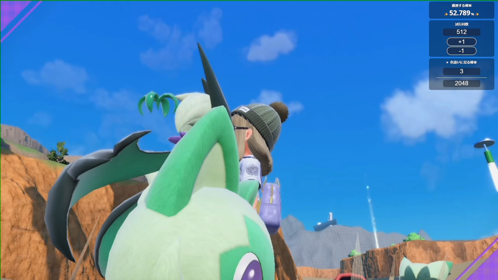

# Shiny Counter Overlay

ポケットモンスターシリーズの色違いのポケモンが出現する確率をOBS等のオーバーレイとして表示するためのリポジトリ。
GitHubPagesを利用して動かしています。

## 特徴

- 配信画面に配置できるタイプのカウンター
- cookieによる確率の保存機能
- スマホやタブレットでもカウント可能
- 背景が半透明なのでゲーム画面またはお使いのオーバーレイに馴染みます

## 進捗

- [x] 1匹のときの計算結果を出力する
- [x] cookieによる保存機能
- [x] 約分機能の追加
- [x] 色違いの確率のプリセットを用意する
- [ ] **デザインを整える←←←**
- [ ] ~~背景をグリーンにするオプション~~

### 検討中

- [ ] ファイルのI/Oによる保存機能
- [ ] 2匹以上の場合の確率計算

## 使用方法

### OBS側

1. ブラウザソースを追加
2. URLに`https://ogurana17.github.io/ShinyCounterOverlay/`を入力
3. 幅`280`高さ`400`にする（この縦横比であれば、ある程度は破綻しません）
4. カスタムCSSを`body { background-color: rgba(0, 0, 0, 0); margin: 0px auto;}`に書き換える
5. `OK`を押す
6. 任意の位置に移動または拡大をする
7. 追加したブラウザソースを右クリックし、`対話（操作）`をクリック

### Shiny Counter Overlay側

1. `元の確率`に数値を入力（9桁まで入力可能）
2. `試行回数`に数値を入力（9桁まで入力可能）
3. `+1`ボタンを押すと1ずつ試行回数が増えていき、`-1`を押すと1ずつ試行回数が減っていきます

元の確率は下記のURLを参照ください。

| 参考元      | URL                                                               |
| -------- | ----------------------------------------------------------------- |
| 色違いの確率   | <https://wiki.xn--rckteqa2e.com/wiki/%E8%89%B2%E9%81%95%E3%81%84> |
| あかし持ちの確率 | <https://wiki.xn--rckteqa2e.com/wiki/%E3%81%82%E3%81%8B%E3%81%97> |

### 確率計算の例

ニャオハの`♀`, `最小`, `色違い`を狙うとする。

ちびちびパワーLv3、かがやきパワーLv3（または国際孵化）、ひかるおまもり有りの場合

$$
\\begin{equation}
\\begin{split}
x &= {1 \\over 8} \\times {1 \\over 64} \\times {1 \\over } \\times {8 \\over 4096} \\
x &= {1 \\over 262144}
\\end{split}
\\end{equation}
$$

ちびちびパワーLv3無し、かがやきパワーLv3（または国際孵化）無し、ひかるおまもり無しの場合

$$
\\begin{equation}
\\begin{split}
x &= {1 \\over 8} \\times {1 \\over 16512} \\times {1 \\over 4096} \\
x &= {1 \\over 541065216}
\\end{split}
\\end{equation}
$$

## 使用上の注意

JavaScriptが扱える小数点桁数は約17桁までとなっています。
例を上げると`色違いになる確率:1/512`の時、`試行回数:19145`までは維持しますが、`19146以降`は`100%`になってしまいます。

ここまで色違いが出ない事は極めて稀だとは思いますが、もう少し精度の高い数値が必要な場合は[BigNumber](https://github.com/MikeMcl/bignumber.js/)を利用して演算することもできます。ただし次の2点に注意してください。

- ローカル環境で実行する必要があります（PC必須）
- 演算にとても時間がかかります

実施する場合は読み進めてください。

### 0. 導入

以下をダウンロードします。
<https://github.com/Ogurana17/ShinyCounterOverlay/archive/refs/heads/master.zip>

### 1. コメントアウト

<https://github.com/Ogurana17/ShinyCounterOverlay/blob/1c8760ce10b056abe89a9422aea634c00815ac66/js/shinyProbability.js#L496-L509>

### 2. アンコメント

<https://github.com/Ogurana17/ShinyCounterOverlay/blob/1c8760ce10b056abe89a9422aea634c00815ac66/js/shinyProbability.js#L511-L514>

<https://github.com/Ogurana17/ShinyCounterOverlay/blob/7f2ff5be3812abb44dbcab4db328c136e9e3fd00/index.html#L113>

需要があればオプションとして実装しますが、「計算速度が遅い」「発生事例が稀」であることから現段階では正式な実装予定はありません。
